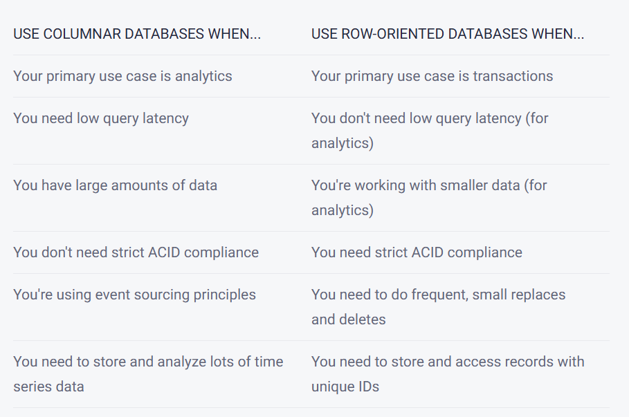
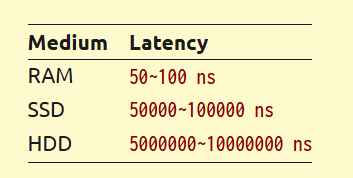

# Database from Scratch

**Reference:** https://build-your-own.org/database/00a_overview

---

## Table of Contents
1. [Durability and Atomicity](#1-durability-and-atomicity)
2. [Indexing Data Structures](#2-indexing-data-structures)
3. [Relational DB on Key-Value Interface](#3-relational-db-on-key-value-interface)

---

## 1. Durability and Atomicity

### What do Traditional Databases Have in Common?

**Question:** What do traditional databases like MySQL, Postgres, and SQLite have in common?

**Answer:**
- **Durability**: They persist data to disk
- **Scalability**: Disk-based storage allows them to work with datasets larger than available memory
- **Independence**: Implemented from scratch, not as wrappers over other databases

### Why Not Just Use Files?

The #1 criterion of traditional databases is **Durability**. Mobile phones use SQLite (a file-based database), but why not just use regular files if databases are essentially files?

**Answer:** Because of "Persisting" - databases guarantee that data will persist even if the machine crashes for any reason.

### Requirements for Crash Survival

**Two key requirements for surviving crashes:**
1. The underlying filesystem must also meet durability requirements (filesystems ≈ databases in this regard)
2. Both atomicity and durability must be maintained

### Difference Between Filesystems and Databases

| Aspect | Filesystem | Database |
|--------|------------|----------|
| Durability Guarantee | ❌ No guarantee (leads to data loss) | ✅ Strong guarantee |
| Write Operations | May be lost on crash | Persisted or fully rolled back |

> **Key Insight:** Making files durable = 50% of building a database

### The `fsync` System Call

**`fsync`** is a filesystem operation that makes all previously written data durable:
- Requests and confirms durability from the operating system
- Databases only return success to clients **after** `fsync` completes

> **💡 Additional Detail:** The `fsync` system call forces the OS to flush all buffered writes to the actual storage device, ensuring data is physically written and not just sitting in memory buffers.

### Atomicity Principle

**Question:** What if the database crashes before or during `fsync`?

**Answer:** We need to follow the principle of **Atomicity**.

**Atomicity Definition:** When dealing with data operations, they should either be:
- **Fully completed** (all changes saved/persisted), OR
- **Fully rolled back** (no changes applied)

**Why Atomicity Matters:** Partial data corruption leads to:
- Skewed results
- Unpredictable system behavior
- Data integrity issues

> **💡 Additional Detail:** Atomicity is part of the ACID properties (Atomicity, Consistency, Isolation, Durability) that define reliable database transactions.

---

## 2. Indexing Data Structures

### Database Performance Factors

Databases must balance two critical factors:
1. **Query Results Accuracy**
2. **Performance Costs** (Memory, I/O, Computation)

This balance leads to two distinct database architectures:

### OLAP vs OLTP Systems

#### OLAP (Online Analytical Processing)
- **Purpose**: Analytical workloads
- **Data Volume**: Large amounts of data with aggregations and joins
- **Indexing**: Limited or non-existent indexing
- **Storage**: Column-based data stores
- **Query Type**: Ad hoc, offline "analytical" queries
- **Latency Sensitivity**: Not sensitive to latency

#### OLTP (Online Transactional Processing)
- **Purpose**: Transactional workloads
- **Data Volume**: Touches small amounts of data using indexes
- **Performance**: Low latency and cost requirements
- **Data Structures**: Based on B+Tree or LSM tree structures
- **Query Type**: Pre-programmed user-facing queries requiring immediate results

> **💡 Definition - Transactions:** Updates, inserts, or real-time transactional workloads that modify entire rows

### Database Type Examples

**Traditional Databases (OLTP):**
- MySQL, PostgreSQL, SQLite

**Big Data Databases (OLAP):**
- ClickHouse, DuckDB

> **💡 Additional Detail:** While OLTP databases can handle OLAP workloads if data is small, it's more effective to use specialized databases for different use cases. Many organizations use both types in their data architecture.

### Column-Based Databases

> **Definition:** Column-based databases store data in columns rather than rows, optimized for analytical workloads like data warehousing and business intelligence.

#### Advantages of Column Storage:
- **Efficient Analytics**: When queries involve scanning/aggregating data across few columns
- **Reduced I/O**: System only reads relevant columns, reducing disk I/O
- **Compression**: Similar data types in columns compress better
- **Examples**: MariaDB ColumnStore, Snowflake, SAP HANA

#### Limitations:
- **Transaction Performance**: Less efficient for transactional workloads
- **Row Operations**: Inserting/updating entire rows requires touching multiple column files

**Question:** If column-based databases are not good for transactions, how can they perform real-time analytics better than row-based databases since wouldn't real-time analytics require constant insertions (transactions)?

**Answer:** Column-based databases achieve real-time analytics through:
1. **Batch Processing**: They often batch writes and process them efficiently
2. **LSM Trees**: Use Log-Structured Merge Trees that optimize for write throughput
3. **Partitioning**: Data is partitioned by time or other dimensions, allowing efficient appends
4. **Specialized Engines**: Designed for high write throughput on analytical workloads
5. **Separation of Concerns**: Often paired with streaming systems that handle the transactional load

> **💡 Additional Detail:** MongoDB is neither columnar nor traditional row-based. It's a NoSQL, document-oriented database optimized for unstructured and semi-structured data.



### In-Memory vs On-Disk Data Structures

#### Performance Considerations

**Challenge:** Indexing data on disk presents unique challenges compared to in-memory indexing.

**Latency Comparison:**
- **RAM**: Nanosecond access times
- **Best SSD**: Microsecond access times (3 orders of magnitude slower than RAM)

#### Specialized Data Structures for Disk

Due to latency differences, databases use specialized data structures:
1. **B+Trees**: Optimized for disk-based random access
2. **LSM Trees**: Optimized for write-heavy workloads

> **💡 Additional Detail:** Databases are much more limited in data structure choices compared to in-memory applications because they must account for disk I/O characteristics.



### Key Challenges in Disk-Based Databases

1. **Persistence Problem**: We still haven't fully solved persisting data to disk
   - Database = Data Structure on Disk
   - Creating data structures is easy
   - **Challenge**: Putting them on disk and updating incrementally while maintaining atomicity and durability

2. **Concurrency Control**: 
   - **In-Memory**: Usually acceptable to serialize data structure access with a single mutex
   
   **Question:** Write more context about Mutex since mutex only allows single person to write and use one resource. Is that true?
   
   **Answer:** 
   - **Mutex (Mutual Exclusion)**: A synchronization primitive that ensures only one thread can access a shared resource at a time
   - **True for writes**: Only one thread can modify the resource
   - **Read operations**: Can sometimes be optimized with reader-writer locks allowing multiple concurrent readers
   - **Performance impact**: In high-concurrency scenarios, mutex contention can become a bottleneck
   
   - **Disk-Based**: I/O latency makes simple mutex-based serialization impractical
   - **Solution**: Requires more advanced concurrency control mechanisms (e.g., MVCC, lock-free algorithms)

> **💡 Additional Detail:** Advanced concurrency control techniques include Multi-Version Concurrency Control (MVCC), optimistic locking, and lock-free data structures that allow multiple operations to proceed concurrently while maintaining data consistency.

---

## 3. Relational DB on Key-Value Interface

### SQL vs Key-Value Interface

**Important Insight:** SQL is just a user interface - it's not fundamental to database architecture.

#### Key-Value Interface: The Foundation
A much simpler and more fundamental interface is **Key-Value (KV)**:
- **Operations**: Get, Set, Update, Delete single keys
- **Additional**: Sort key lists, range queries
- **Simplicity**: One layer lower than SQL interface
- **Foundation**: Relational databases are built on top of KV-like interfaces called **Storage Engines**

> **💡 Additional Detail:** The Key-Value interface is the foundational layer that enables more complex database operations. Think of it as the "assembly language" of databases - simple operations that can be combined to create complex functionality.

### KV Interface Definition

```golang
type KV interface {
    // Basic operations
    Get(key []byte) (val []byte, ok bool)
    Set(key []byte, val []byte)
    Del(key []byte)
    
    // Range query operations
    FindGreaterThan(key []byte) Iterator
}

type Iterator interface {
    HasNext() bool
    Next() (key []byte, val []byte)
}
```

### Why Key-Value is Fundamental

1. **Simplicity**: Minimal interface with maximum flexibility
2. **Performance**: Direct mapping to underlying storage mechanisms
3. **Building Block**: Higher-level interfaces (SQL, Document stores) built on top
4. **Storage Engine**: Forms the core of database storage engines

> **💡 Additional Detail:** Popular databases and their storage engines:
> - **MySQL**: InnoDB (KV-based storage engine)
> - **PostgreSQL**: Heap files with B-tree indexes (KV-like access patterns)
> - **SQLite**: B-tree pages (KV storage)
> - **LevelDB/RocksDB**: Pure KV stores used by many modern databases

### From KV to SQL

**How SQL operations map to KV:**
- **SELECT with WHERE**: Range queries and key lookups
- **INSERT**: Set operations with generated keys
- **UPDATE**: Get-modify-set operations
- **DELETE**: Del operations
- **Indexes**: Additional KV stores mapping indexed values to primary keys
- **Joins**: Multiple KV lookups and in-memory processing

> **💡 Additional Detail:** Understanding this KV foundation is crucial for database design and optimization. When you write a SQL query, the database engine translates it into a series of KV operations against its storage engine.

---

## Summary

Building a database from scratch involves mastering three core concepts:

1. **Durability & Atomicity**: Ensuring data survives crashes through proper use of `fsync` and atomic operations
2. **Indexing Data Structures**: Choosing appropriate structures (B+Trees, LSM Trees) based on workload patterns (OLTP vs OLAP)
3. **Storage Architecture**: Understanding that complex interfaces like SQL are built on simple KV foundations

The journey from files to databases involves solving persistence, performance, and concurrency challenges while maintaining the ACID properties that make databases reliable.

---
